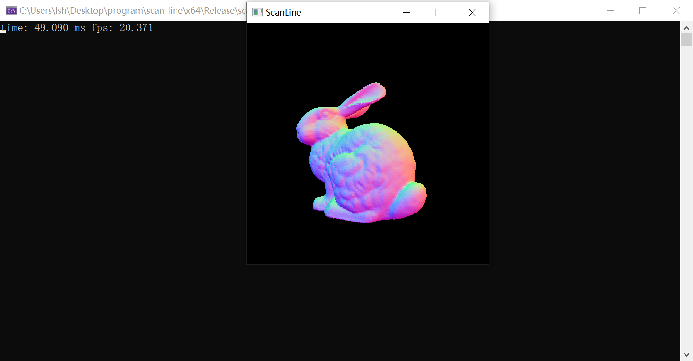

# 扫描线算法
本项目实现了`扫描线zbuffer`和`区间扫描线`两种消隐算法，两种算法使用统一的基础数据结构。
## 编程环境
- 操作系统：win10 x64
- IDE：visual studio 2019
- 编程语言：c++17
- 第三方库：
    - glfw: 轻量级跨平台窗口系统，用于窗口显示和键鼠交互。
    - glad：OpenGL函数的查询和加载库。
    - glm：c++的一个数学库，主要提供向量和矩阵的操作。
    - tiny_obj_loader：轻量级的obj格式解析器
## 用户界面使用说明
### 命令行格式
`scan_line.exe model_name width height`

例子如下

`scan_line.exe bunny_69k 512 512`

注意需要把obj文件放在当前目录的`models`文件夹下。

### 显示界面与用户交互
启动后会出现一个窗口显示模型，相机绕着模型水平转动。用户可以`ws`键上下调整相机视角。用户可以通过`space`键，选择`扫描线zbuffer`算法或者是`区间扫描线算法`。默认是`扫描线zbuffer`。控制台会输出相应的切换信息。控制台会一直输出当前消隐算法的单帧消耗时间以及当前帧率。


## 数据结构
```c++
//活动边：用于表示当前正在处理的边
struct Activate_Edge {
    //当前x,z坐标
		float x, z;
    //y+1时x方向增量
		float dx;
    //y+1时z方向增量
		float dz;
    //剩余扫描线数量
		uint dy;
    //所属的多边形id
		uint pid;
    //属于同个多边形的下一个活动边的指针
		Activate_Edge* next_ae = nullptr;
	};
//活动多边形：用于表示正在处理的多边形
struct Activate_Polygon {
    //对应的多边形id
    uint pid;
    //剩余扫描线数量
    uint dy;
    //该多边形的第一条活动边
    Activate_Edge* ae = nullptr;
};
//多边形：用于表示多边形
struct Polygon {
    //(a,b,c,d) 用于表示多边形所在平面：ax+by+cz+d=0
    vec4 plane;
    //跨越的扫描线数量
    uint dy;
    //dz/dx，单位x变化下z的增量
    float dzx;
    //多边形的面法线
    vec3 normal;
    //finished表示多边形是否完成，in表示多边形是否在区间中，分别用于扫描线zbuffer和区间扫描线两种算法
    union {
        bool finished = false;
        bool in;
    };
    //指向其活动多边形的指针
    std::list<Activate_Polygon>::iterator ap;
};
struct Edge {
    //上端点的xz坐标，x是屏幕空间，z是ndc空间中
    float x, z;
    //单位y变化的x增量
    float dx;
    //单位y变化的z增量
    float dz;
    //跨越的扫描线数量
    uint dy;
    //所属的多边形id
    uint pid;
};
//多边形表
std::vector<Polygon> PT;
//边表
std::vector<Edge> ET;
//分类多边形表，按照多边形上端点分类，每类按照x坐标升序排列
std::vector<std::vector<uint>> SPT;
//分类边表，按照边的上端点分类，每类按照x坐标升序排列
std::vector<std::vector<uint>> SET;
//活动边表，频繁修改，所以用list
std::list<Activate_Edge> AET;
//活动多边形表，频繁修改，所以用list
std::list<Activate_Polygon> APT;
```
## 算法实现
### 扫描线zbuffer
对于该算法我们需要维护一个活动边表和活动多边形表。维护一条扫描线大小的zbuffer。扫描线从上到下迭代处理。每次处理有三部分组成
1. 更新
2. 消隐判断
3. 清理
#### 更新
从分类多边形表和分类边表中，将该位置处的多边形和边加入到活动多边形和活动边表中。除此之外，每个活动多边形还维护了一条链表，用于存储属于这个多边形的活动边。这个可以通过边的多边形id，以及多边形中存储的活动多边形指针，找到边所属的活动多边形，然后按照边的上端点位置，升序插入到链表中。
#### 消隐判断
遍历每个活动多边形，遍历其多边形内的活动边链表，每次拿出两条活动边，因为插入的时候保证是有序的，所以拿出的两条活动边肯定是相邻的。然后根据多边形的dzx从左到右改变z值，判断当前像素的深度是否小于对应zbuffer的深度，是的话调用`shading`函数算出该像素的颜色值，并更新对应的zbuffer的深度。
#### 清理
将当前活动边表和活动多边形表中的剩余扫描线数量-1，并且更新xz坐标，如果剩余扫描线数量为0，则将这个元素从对应的链表中删除。除此之外，删除活动边的时候，还需要清理在活化多边形内部的链表项。
### 区间扫描线
区间扫描线需要维护一个活动边表，一个活动多边形表。活动多边形表记录当前行已经进入但还未退出的多边形。扫描线从上到下迭代处理。每次处理有三部分组成
1. 更新
2. 消隐判断
3. 清理
#### 更新
从分类边表中将该位置处的边都加入到活动边表中。然后按照x坐标升序排列。
#### 消隐判断
遍历活动边链表，每次从中拿出相邻的一个区间，按照第一个活动多边形的信息着色。然后判断该区间右端点所在的多边形。如果右端点所在的多边形还未进入活动多边形表，则将其插入链表，要保证按照深度升序插入。如果右端点所在的多边形已经进入了活动多边形表，则将其从表中删除。
#### 清理
更新所有活动边的xz坐标，将剩余扫描线数量-1，如果剩余扫描线数量为0，则将这个元素从链表中删除。
## 非三角形和非凸多边形考虑
为了能够处理除了三角形以外的其他多边形，我在活动多边形中用一条有序短链表，存储属于该多边形的活动边。如果只需要处理三角形，在扫描线zbuffer中，只需要从三角形三条边的三种组合中选择合适的边对即可。因为非凸多边形可能和一条扫描线交于多对边对，所以需要用链表存储。这样做的缺点是，效率会稍微降低一些，因为链表的处理比直接三角形取边对要慢一些，优点是可以处理其他多边形。
## 实验结果
见`experiment`文件