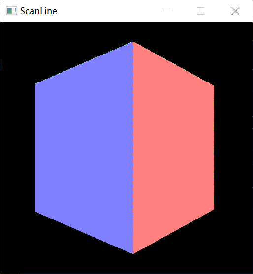
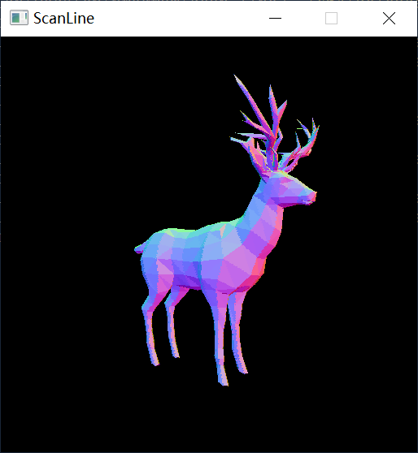
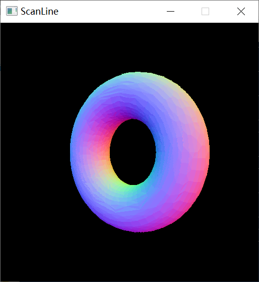
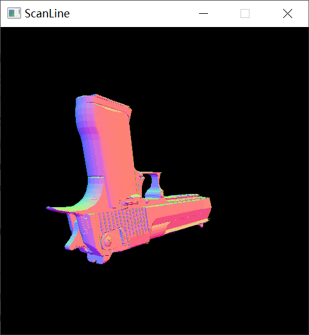
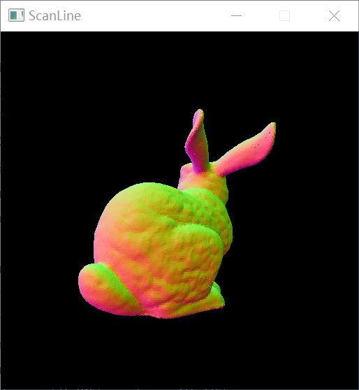

# 扫描线算法实验结果
## 性能测试
以下结果的使用相同的shading函数`color = (normal+(1,1,1))/2`，窗口大小均为(512,512)
|  三角面片规模   | 扫描线zbuffer 时间(ms) / 帧率  | 区间扫描线 时间(ms) / 帧率 
|  ----  | ----  | ---- | 
| box 12  | 0.811 / 1233.046 | 0.490 / 2040.816 | 
| deer 1500  | 1.653 / 604.961 | 3.393 / 294.724 |
| torus 3k  | 3.697 / 270.490 | 7.490 / 133.511 |
| deagle 8k  | 6.529 / 153.163 | 12.316 / 81.195 |
| bunny 69k  | 54.315 / 18.411| 74.587 / 13.407 |
| Alucy 448k  | 335.748 / 2.978 | 383.561 / 2.607 |

## 绘制的结果
区间扫描线和扫描线zbuffer的结果一致。

### 非凸多边形绘制
这个模型由5个顶点构成，解析的时候没有预处理成三角形，所以是一个完整的非凸多边形。

## 结果分析
总体来说扫描线zbuffer在当前环境下是快于区间扫描线的。box规模太小，时间波动较大，没有比较的意义。面片数小于10k的情况下，扫描线zbuffer的速度差不多是区间扫描线的2-3倍。随着面片规模增大，两种算法的时间趋近一致，可能此时的性能瓶颈在边表的构建，而非消影算法。

个人认为，区间扫描线虽然利用了连贯性，避免了重复绘制的开销，但其实现较为复杂，而且每行都要做链表的排序这种比较费时的操作，整体性能消耗比较大。在绘制开销比较小的时候，比如现在只是用normal来着色，减少的重复绘制开销远不及链表排序增加的开销多。所以整体速度不如扫描线zbuffer。

